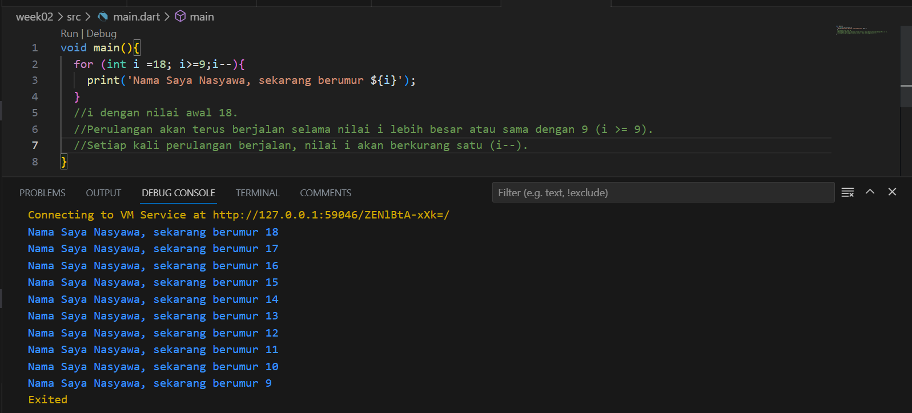

#Pemrograman Mobile -Pertemuan 2

Nasyawa Ramadhia // 2141720011

Soal 1

Soal 2 //
"Mengapa sangat penting untuk memahami bahasa pemrograman Dart sebelum kita menggunakan framework Flutter ? Jelaskan!"

=> Karena bahasa Dart adalah inti dari framework Flutter dan juga open source, Dart juga fleksibel

Soal 3 // "Rangkumlah materi dari codelab ini menjadi poin-poin penting yang dapat Anda gunakan untuk membantu proses pengembangan aplikasi mobile menggunakan framework Flutter."
=> Dart ini opensource yang lebih baik dipelajari sebelum menggunakan framework flutter, dart ini punya fitur-fitur terkini seperti:
- Garbage collection: untuk mengelola atau menangani dealokasi memori
- ada nullsafe, yang mana default dari dart ini tidak bisa null dengan nullsafe jadi bisa menampilkan nilai null
dart juga ada Arithmetic operators, Increment and decrement operators, Equality and relational operators, Logical operators dan operators ini ada beberapa yg tidak sama dengan java, javascript dan bhasa lainnya

Soal 4 // Kelompok 2
Link : https://docs.google.com/presentation/d/10twQwvieYzOkzUaktsHMcGNGH2-qkeOwf-6lQTg3ZEs/edit?usp=sharing
