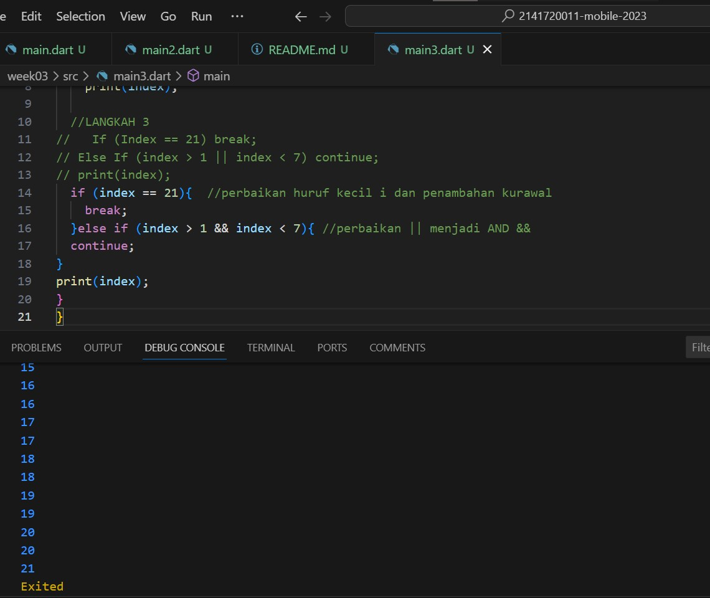

#Pemrograman Mobile -Pertemuan 3 -  Percabangan dan Perulangan
Nasyawa Ramadhia // 2141720011

Praktikum 1 - Menerapkan Control Flows ("if/else)
LANGKAH 1

LANGKAH 2
=> Error disini disebabkan
- Belum ditambahkan void main(){}
- Penulisan IF ELSE yang kurang tepat dan ada yg kurang kurung kurawalnya

Perbaikan Kode 

LANGKAH 3 
menambahkan kode ini membuat error

Errornya= - Variabel test yang dideklarasikan lagi dan if harusnya berupa ekspresi boolean (true false), buakn string
Perbaikan Kode

Praktikum 2 - Menerapkan Perulangan "While" dan "do-while"

LANGKAH 1

LANGKAH 2

Sempat Error karena variabel 'counter' belum didefinisikan
dan diperbaikan ini counternya saya inisialisasi dengn int nilai awal 0 
outputnya 0-32, lalu berhenti

LANGKAH 3

Pada penambahan ini output yg dihasilkan tidak terbaca string sehingga loop angka
Saat sudah di revisi, membuatkan counter terbaca String
dan output akan menampilkan counter sebanyak 76
dan langkah sebelumnya juga ikut ditampilkan

Praktikum 3 - Menerapkan Perulangan "for" dan "break-continue"

LANGKAH 1

Terjadi error,

LANGKAH 2
Perbaikan Kode
- menambahkan tipe data pada var index
- merevisi tulisan indexnya
- menambahkan iterasi agar loopnya bisa berhenti di <27

LANGKAH 3

Errornya karena ada kesalahan penulisan variabel, di Dart ini sifatnya cse-sensitive.
Operator Logika 
PERBAIKAN
- merevisi penulisan if,index 
- menambahkan kurawal
- mengganti operator || menjadi &&

Outputan nya akan mencetak angka 10 hingga 26, jika index mencapai 21, loopnya dihentikan karena break
jika indexnya diluar rentang 1-7 maka continue akan mengabaikan

TUGAS PRAKTIKUM
Buatlah sebuah program yang dapat menampilkan bilangan prima dari angka 0 sampai 201 menggunakan Dart. Ketika bilangan prima ditemukan, maka tampilkan nama lengkap dan NIM Anda.

