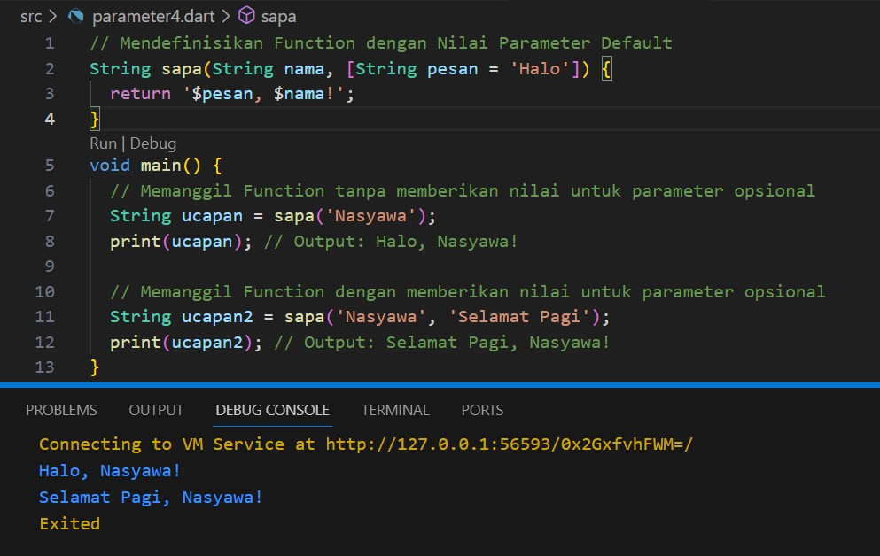

**#Pemrograman Mobile -Pertemuan 4 -  Collections, Records, dan Functions.**
Nasyawa Ramadhia // 2141720011

1.  Kerjakan Praktikum 1 sampai 5

**Praktikum 1: Eksperimen Tipe Data List**

LANGKAH 1

LANGKAH 2

=>yang terjadi bisa di RUN
- var list disana berisi 3 elemen/ 3 nilai terdiri dari angka 1,2,3
- assert ini untuk mengecek/ menguji
- assert(list.length == 3) ini untuk menguji apakah panjang list sama dengan 3, nanti jika hasilnya ga sama programnya error.
- assert(list[1] == 2), mengeeck apakah indeks [1] ini = 2, jika tidak maka akan error
- print(list.length), mencetak panjang listnya
- list[1] = 1; ini mengubah nilai indeks [1] dari 2 jdi 1

LANGKAH 3

BISA DIEKSEKUSI namun supaya default value = null, maka saya menandai tipe datanya dengan ? --> <String?>

Tapi jika dilihat dari catatan "Dart akan melakukan infers pada variabel list dengan tipe data List. Jika Anda mencoba menambahkan elemen berupa objek non-integer pada list, maka analyzer atau runtime akan error."
contohnya seperti ini 

**Praktikum 2: Eksperimen Tipe Data Set**
LANGKAH 1

LANGKAH 2
=>Apa yg terjadi, DAPAT DIEKSEKUSI
dalam kode ini kita membuat Set bernama 'halogens. Set adalah koleksi yang tidak memiliki urutan dan tidak mengizinkan duplikasi elemen, 
Dan halogens dalam kode di atas itu berisi beberapa elemen string yg unik sehingga bisa di eksekusi dan tidak error.

LANGKAH 3

=> output kosong karena belum diberi nilai
- perbaikan

**Praktikum 3: Eksperimen Tipe Data Maps**
LANGKAH 1

LANGKAH 2
=> Yang terjadi bisa di RUN
Langkah ini menggunakan MAP(key-value)
Dalam Dart, MAP ini memungkinkan keys dan values untuk memiliki tipe data yang berbeda
LANGKAH 3

=> Yang terjadi ERROR
karena yg digaris merah alias var 'gifts' ini hrusnya 'mhs1' dan var 'nobleGases' ini 'mhs2'
PERBAIKAN:

**Praktikum 4: Eksperimen Tipe Data List: Spread dan Control-flow Operators**
LANGKAH 1

LANGKAH 2
=> ERROR karena "list1" ini seharusnya list
PERBAIKAN:

LANGKAH 3

=>Error karena ada nilai null, sedangkan pd code tidak diberikan null-safety
PERBAIKAN:
Tambahkan variabel list berisi NIM Anda menggunakan Spread Operators.

LANGKAH 4

=> ERROR ,mungkin karena belum dideklarasikan dan belum diberi nilai  
- PERBAIKAN

Jika False, outlet tidak disertakan

LANGKAH 5
=>ERROR,karena penggunaan if expression td valid/sintaksnya tdk sesuai

- PErbaikan
Jika bukan manager yg muncul hnya nav2

Tapi, if == manager 'Inventory' ikut muncul

LANGKAH 6
=>BISA DI RUN

for expression ini untuk membuat List baru (listOfStrings) berdasarkan elemen-elemen dari List listOfInts
for expression pda kode ini untuk mengulangi tiap elemen 'i' dlm list 'listOfInts'
Assert digunakan untuk memastikan bahwa kondisi yang diberikan benar.
- Collection For
 fitur yang memungkinkan utk membuat koleksi baru (seperti List, Set, atau Map) dg menggabungkan elemen-elemen dari koleksi yg ada
 manfaatnya :
    - Sintaksis nya lebih Ringkas
    - Transformasi data dengan lebih efisien.

**Praktikum 5: Eksperimen Tipe Data Records**
LANGKAH 1

LANGKAH 2
PERBAIKAN:

LANGKAH 3

- Gunakan fungsi tukar() di dalam main() sehingga tampak jelas proses pertukaran value field di dalam Records.

LANGKAH 4

=> Error karena belum diinisialisasi dan ada null

LANGKAH 5

- Gantilah salah satu isi record dengan nama dan NIM.

**TUGAS PRAKTIKUM**

2. Jelaskan yang dimaksud Functions dalam bahasa Dart!
=> Function adalah blok kode yang dapat dipanggil atau dieksekusi untuk melakukan tugas tertentu. Function jg menerima input dalam bentuk argumen (parameter), dapat melakukan operasi pada argumen tersebut, dan seringkali mengembalikan hasil (return value).
3. Jelaskan jenis-jenis parameter di Functions beserta contoh sintaksnya!
=> ada tiga jenis parameter yang berbeda dalam Functions
    
    a. Required Positional Parameters (Parameter Posisi yang Diperlukan)
    - parameter yang harus disediakan saat memanggil Function.
    - dideklarasikan dalam tanda kurung biasa ()
    contoh sintaksnya:
    

    b. Optional Positional Parameters (Parameter Posisi Opsional)
    - parameter yang tidak wajib disediakan saat memanggil Function.
    - dideklarasikan dalam tanda kurung biasa (), tetapi dengan tanda kurung kotak [] untuk menandai bahwa mereka bersifat opsional.
    - kita dapat memberikan nilai sesuai posisinya tanpa harus menyebutkan nama parameter.
    contoh sintaks:
    
    
    c. Named Parameters (Parameter Bernama)
    - parameter yang disebutkan dengan nama mereka saat memanggil Function
    - dideklarasikan dalam tanda kurung kurawal {}, dengan memberikan nama parameter diikuti oleh tipe datanya.
    - 
    contoh sintaks:
    
    d. Default Parameter Values (Nilai Parameter Default)
    - Nilai parameter default ditentukan dengan memberikan nilai dalam deklarasi parameter.
    - Nilai default digunakan jika pemanggil Function tidak memberikan nilai untuk parameter tersebut.
    contoh sintaks:
     

4. Jelaskan maksud Functions sebagai first-class objects beserta contoh sintaknya!
First-Class Objects berarti function tsb punya sifat:
    - Dapat Disimpan dalam Variabel
    - Dapat Dikirim sebagai Argumen
    - Dapat Dikembalikan dari Function
    - Dapat Dijalankan (Invoked)
    
5. Apa itu Anonymous Functions? Jelaskan dan berikan
contohnya!
=> Functions yang tidak memiliki nama yang terkait dengannya.
disebut juga Lambda Functions atau Closure.
Anonymous Functions ini berguna ketika kita perlu meneruskan sebuah Function sebagai argumen ke Function lain, atau ketika kita ingin membuat Function sederhana tanpa harus mendeklarasikan nama untuknya. 
Dengan Anonymous Function, kita dpt mengekspresikan kode dengan lebih ringkas dan ekspresif. 
Contoh nya:

6. Jelaskan perbedaan Lexical scope dan Lexical closures! Berikan contohnya!
    - Lexical Scope (Lingkup Leksikal)
    mencari variabel yang digunakan dalam suatu fungsi atau blok kode.
    ruang lingkup variabel ditentukan secara statis, hanya dengan letak kode.

    - Lexical Closures (Penutupan Leksikal)
    kemampuan sebuah fungsi untuk mengakses variabel di lingkungan leksikalnya, bahkan setelah fungsi tersebut selesai dieksekusi.

7. Jelaskan dengan contoh cara membuat return multiple value di Functions!
=>Dalam Dart, kita tidak dapat secara langsung mengembalikan multiple values. Kita dapat menggunakan bbrpa pendekatan seperti menggunakan Map, List, atau Class.
- Return Multiple Menggunakan Map

- Return Multiple Menggunakan List

- Return Multiple Menggunakan Class
