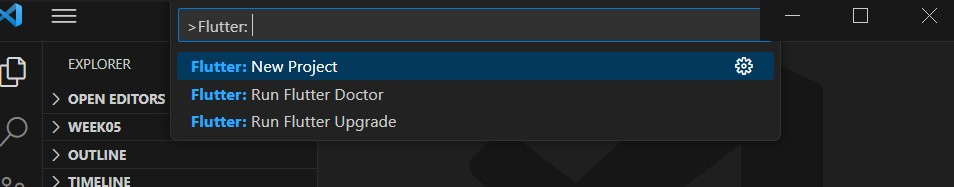

**Nasyawa Ramadhia Kirana // 2141720011  // 22**
# | Flutter Fundamental |

# Praktikum 1 : Membuat Project Flutter Baru
**LANGKAH 1**
Command Palette. Pilih New Application Project.

**LANGKAH 4**
"Your Flutter Project is ready!"

# Praktikum 2: Membuat Repository GitHub dan Laporan Praktikum
**LANGKAH 12**
project hello_world

# Praktikum 3: Menerapkan Widget Dasar
**Langkah 1: Text Widget**
buat file baru di dalam basic_widgets dengan nama text_widget.dart.

Lakukan import file text_widget.dart ke main.dart,
dengan menambahkan dulu importnya / biasanya auto ada
import 'package:hello_world/basic_widget/text_widget.dart';

**Langkah 2: Image Widget**
Buat sebuah file image_widget.dart di dalam folder basic_widgets
Lakukan penyesuaian asset pada file pubspec.yaml

import di file main.dart

#  Praktikum 4: Menerapkan Widget Material Design dan iOS Cupertino
**Langkah 1: Cupertino Button dan Loading Bar**

Buat file di basic_widgets > loading_cupertino.dart. Import stateless widget dari material dan cupertino

**Langkah 2: Floating Action Button (FAB)**

Buat file di basic_widgets > fab_widget.dart. Import stateless widget dari material

**Langkah 3: Scaffold Widget**
Scaffold widget digunakan untuk mengatur tata letak sesuai dengan material design.

**Langkah 4: Dialog Widget**

**Langkah 5: Input dan Selection Widget**

**Langkah 6: Date and Time Pickers**

