**Nasyawa Ramadhia Kirana // 2141720011  // 22**
# | Flutter Fundamental by phone |

# Praktikum 1 : Membuat Project Flutter Baru
Buat nama project flutter hello_world

**LANGKAH 4**
"Your Flutter Project is ready!"

# Praktikum 2: Membuat Repository GitHub dan Laporan Praktikum
run project hello_world

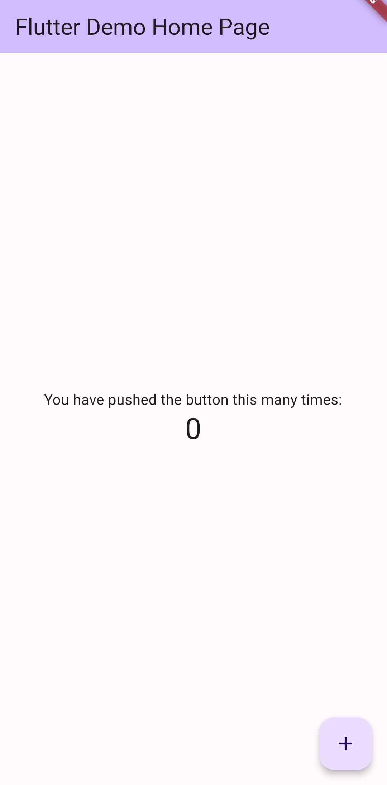
# Praktikum 3: Menerapkan Widget Dasar
**Langkah 1: Text Widget**
buat file baru di dalam basic_widgets dengan nama text_widget.dart.
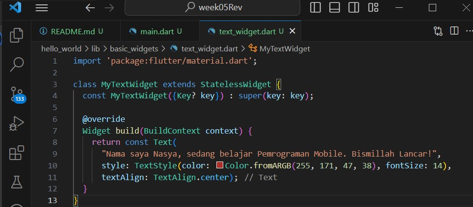
Lakukan import file text_widget.dart ke main.dart,
dengan menambahkan dulu importnya / biasanya auto ada
import 'package:hello_world/basic_widget/text_widget.dart';
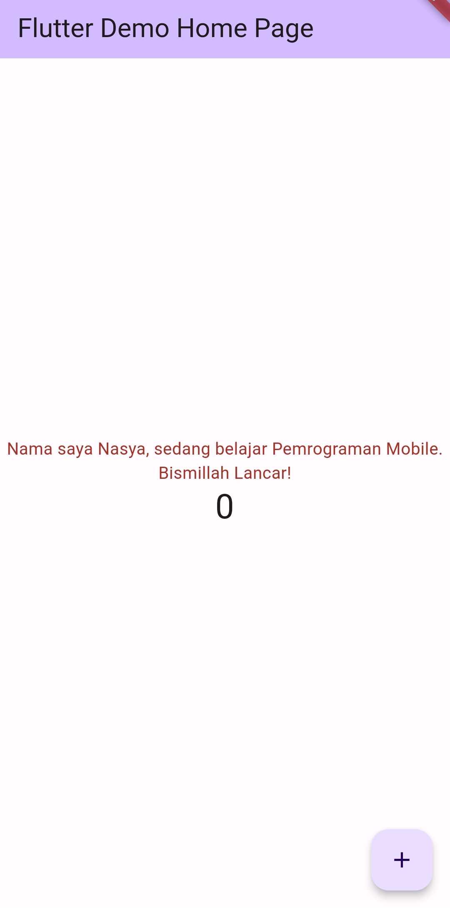

**Langkah 2: Image Widget**
file image_widget.dart di dalam folder basic_widgets
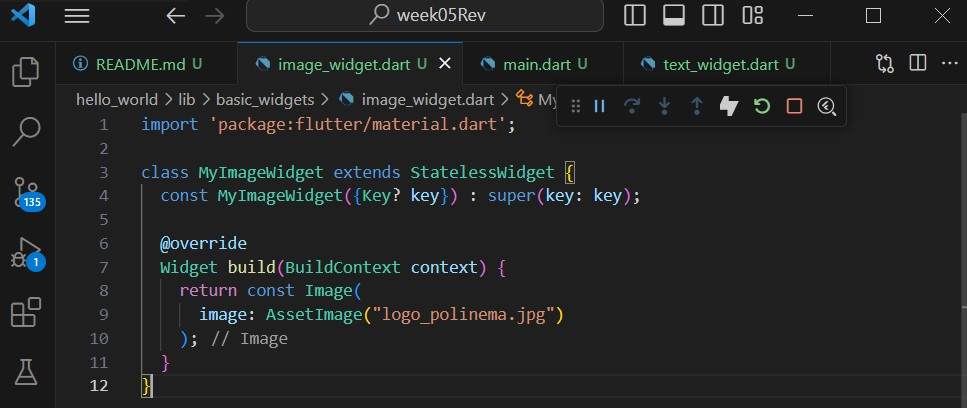
import di file main.dart
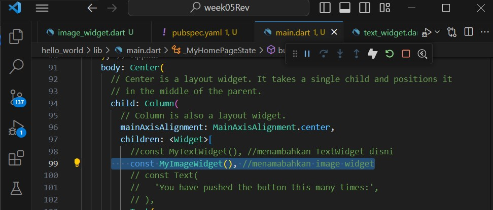
output hp:
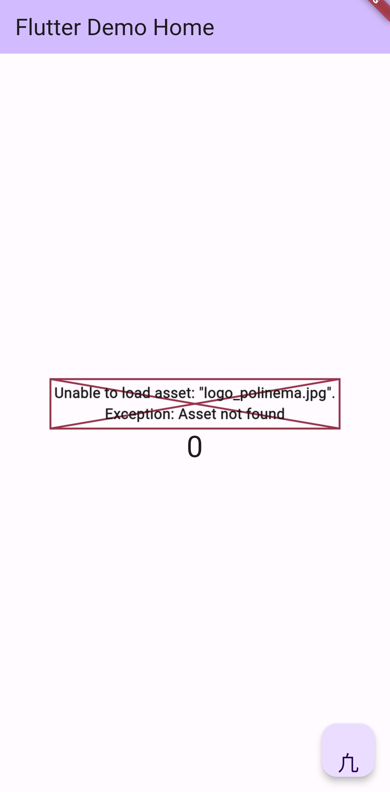

#  Praktikum 4: Menerapkan Widget Material Design dan iOS Cupertino
**Langkah 1: Cupertino Button dan Loading Bar**

Buat file di basic_widgets > loading_cupertino.dart. Import stateless widget dari material dan cupertino
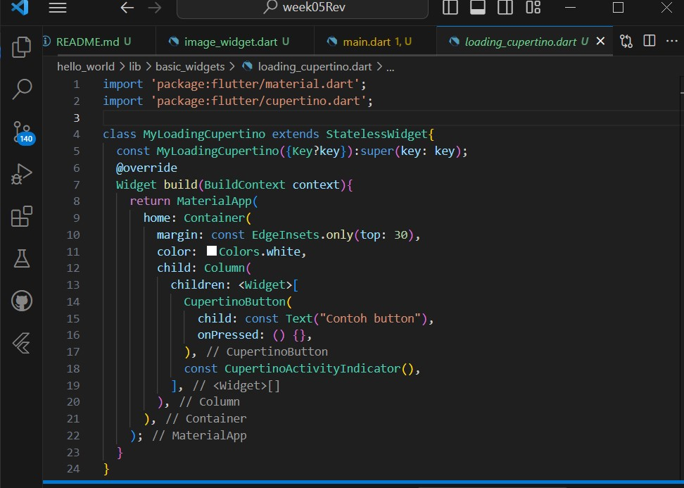
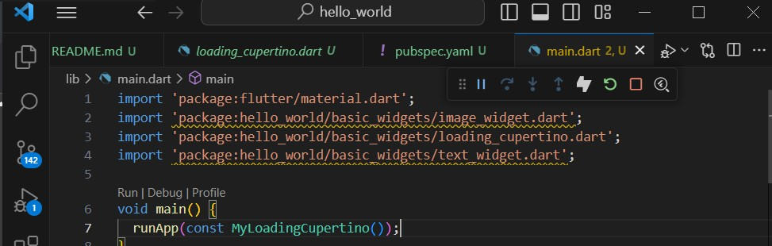
Output Hp:
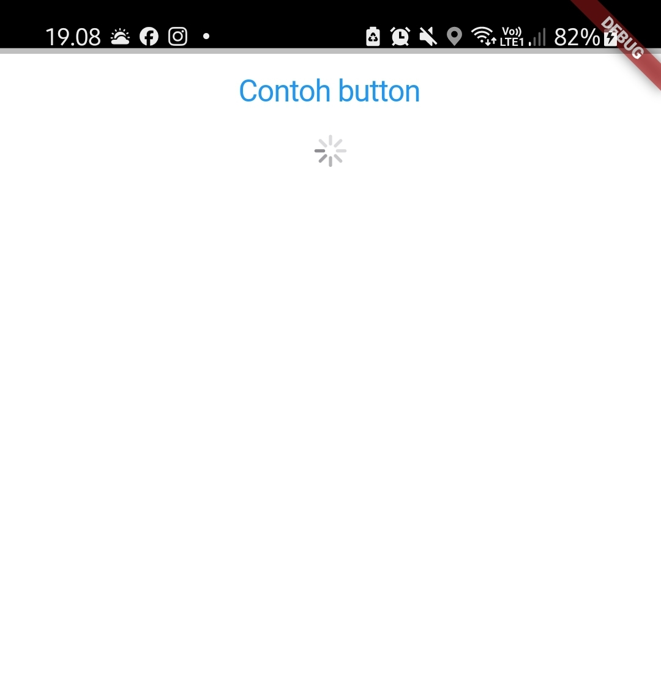

**Langkah 2: Floating Action Button (FAB)**

Buat file di basic_widgets > fab_widget.dart. Import stateless widget dari material
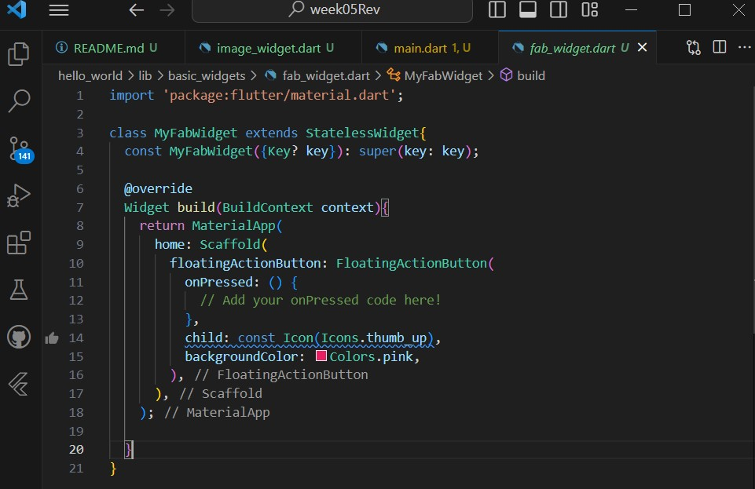
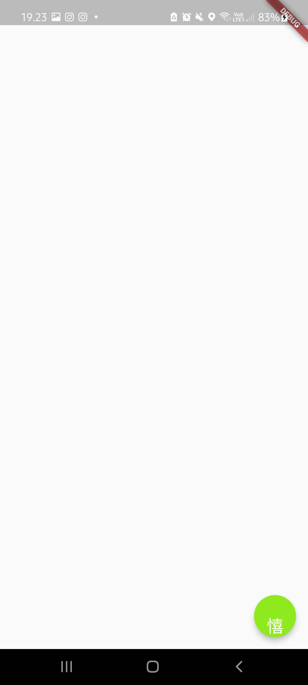
dilangkah ini, output saya ada sedikit kerusakan waktu by web masih muncul iconnya tapi saat di hp, tidak muncul :(
**Langkah 3: Scaffold Widget**
Scaffold widget digunakan untuk mengatur tata letak sesuai dengan material design.

**Langkah 4: Dialog Widget**
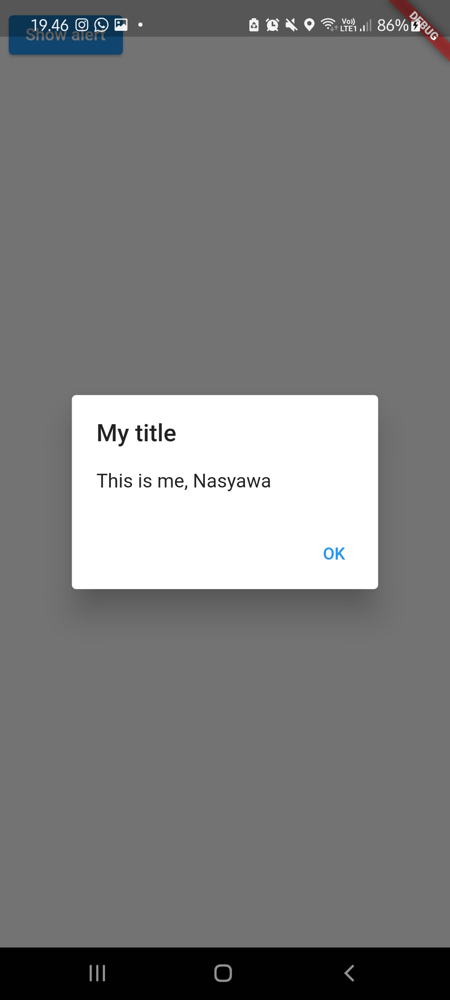
**Langkah 5: Input dan Selection Widget**

**Langkah 6: Date and Time Pickers**
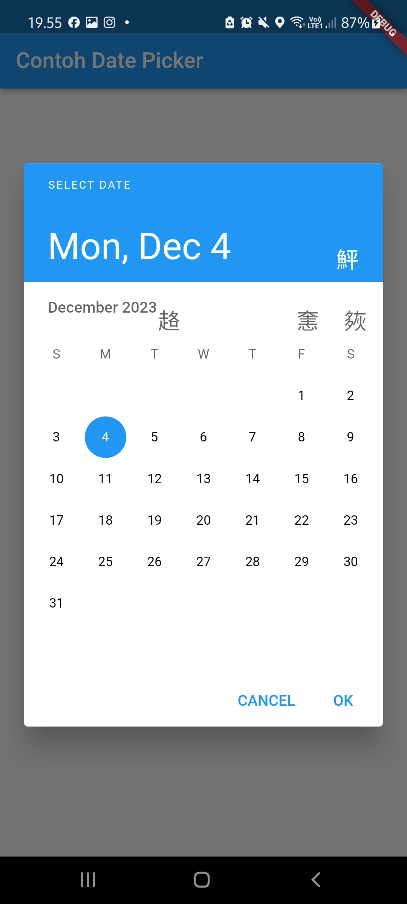
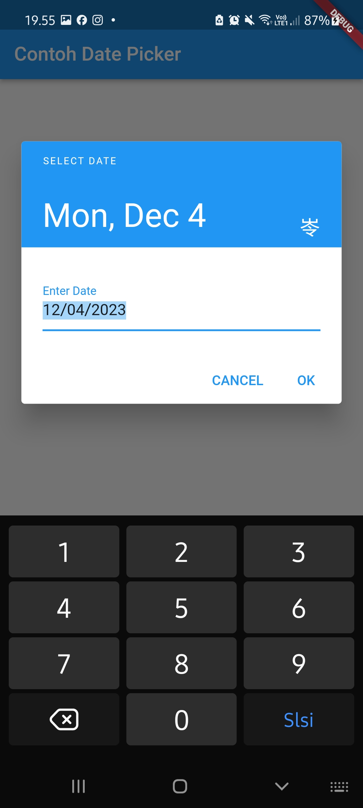
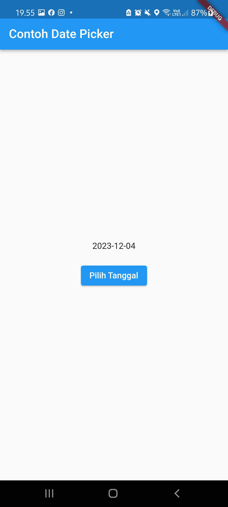

# | TUGAS CODELABS |
**Nasyawa Ramadhia Kirana // 2141720011  // 22**

**3. Membuat project**
Proyek baru, namer_app

**Menyalin & Menempelkan aplikasi awal**
File pubspec.yaml menentukan informasi dasar tentang aplikasi Anda, seperti versi aplikasi saat ini, dependensi aplikasi, dan aset yang digunakan oleh aplikasi untuk pengiriman.

 file konfigurasi lainnya dalam proyek tersebut, analysis_options.yaml.

 **4. Menambahkan tombol**

- Meluncurkan aplikasi
 dalam web:
 
 dalam mobile:
  
  output di mobile,teks terlalu pojok sehingga terhalang oleh tatus bar.

- Hot Reload Pertama
Menambahkan sesuatu pada string di objek Text pertama
 
 
 terlihat, tp kasusnya masih sama seperti diatas.

- Menambahkan tombol
code

ketika button di press

 ketika button di press

Aplikasi akan menghasilkan pasangan kata acak baru setiap kali Anda menekan tombol Next.

**5.Memperindah tapilan aplikasi**

panggil menu Refactor. 

terbuatlah kelas baru

Menambahkan Kartu

menciptakan widget induk baru dengan Wrap with Padding

 menentukan widget induk

Kode ini menggabungkan widget Padding, dan juga Text, dengan widget Card.

di web:

di mobile:

  
Tema dan Gaya
Dalam Flutter, tema (theme) adalah kumpulan nilai-nilai yang memengaruhi tampilan visual aplikasi seperti warna, jenis huruf, padding, dan banyak lagi

outpt web:

output mobile:

TextTheme
memperbaiki ukuran teks terlalu kecil dan warnanya membuat teks sulit dibaca

mobile:

Meningkatkan aksesibilitas

Menempatkan UI di tengah

Refactor (dengan Ctrl+. atau Cmd+.), lalu pilih Wrap with Center.

dengan sizedbox 

**6. Menambahkan fungsi**
Menambahkan logika bisnis

Menambahkan tombol
menu Refactor dengan Ctrl+. atau Cmd+., lalu pilih Wrap with Row.

Tambahkan tombol Like dan hubungkan ke toggleFavorite().

**7. Menambahkan Kolom diSamping Navigasi**

Widget stateless versus stateful

konversi MyHomePage menjadi widget stateful.

Garis bawah (_) di awal _MyHomePageState membuat class tersebut menjadi class pribadi

SetState

Kolom samping navigasi kini merespons interaksi pengguna.

Menggunakan selectedIndex
Aplikasi sekarang beralih di antara GeneratorPage kita dan placeholder yang akan segera menjadi halaman Favorites.

Tingkat respons
Refactor Scaffold

Sekarang aplikasi Anda merespons lingkungannya, seperti ukuran layar, orientasi, dan platform. Dengan kata lain, aplikasi Anda sudah responsif.

