# Praktikum 5: Membangun Navigasi di Flutter
**Nasyawa Ramadhia Kirana // 2141720011 // 22**

- belajar untuk berpindah halaman dan mengirimkan data ke halaman lainnya
- Desain aplikasi menampilkan sebuah ListView widget yang datanya bersumber dari List. Ketika item ditekan, data akan dikirimkan ke halaman berikutnya.

**Langkah 1: Siapkan project baru**
project baru Flutter dengan nama belanja
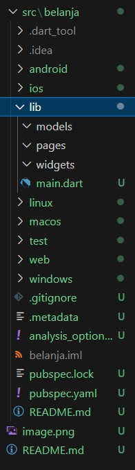

**Langkah 2: Mendefinisikan Route**
Buatlah dua buah file dart dengan nama home_page dart dan item_page.dart pada folder pages
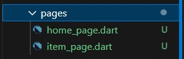
Untuk masing-masing file, deklarasikan class HomePage pada file home_page.dart dan ItemPage pada item_page.dart. Turunkan class dari StatelessWidget
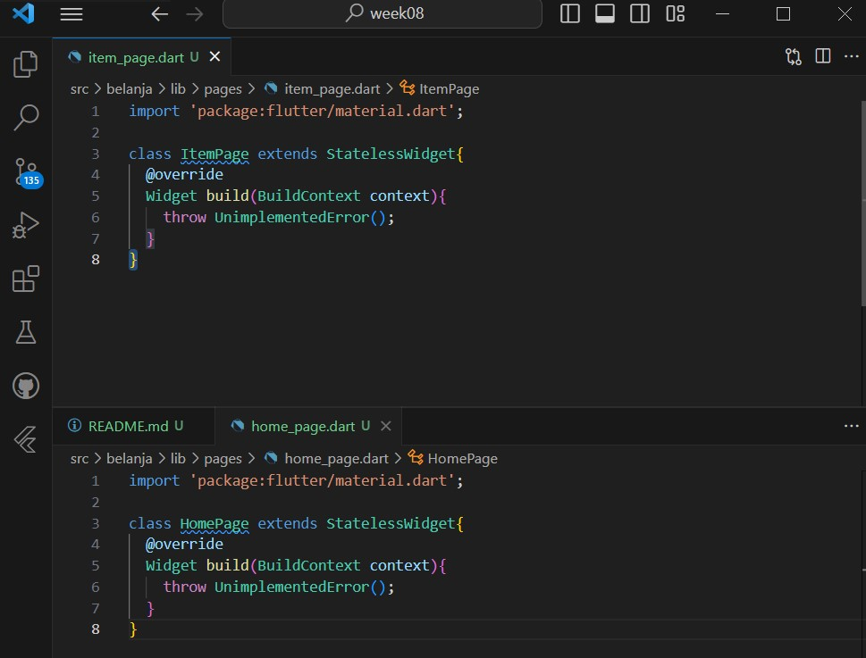

**Langkah 3: Lengkapi Kode di main.dart**
Mendefinisikan Route untuk kedua halaman tersebut. 
Definisi penamaan route harus bersifat unique. 
- Halaman HomePage didefinisikan sebagai /. 
- Dan halaman ItemPage didefinisikan sebagai /item.
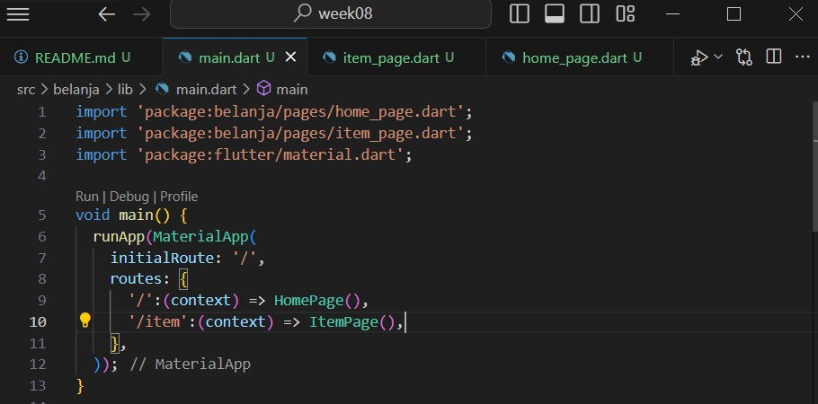

**Langkah 4: Membuat data model**
proses pemodelan data, item.dart
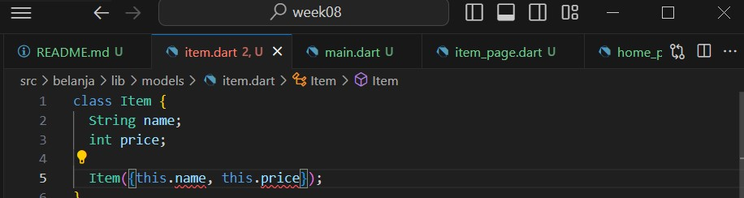
karena merah, saya ganti required
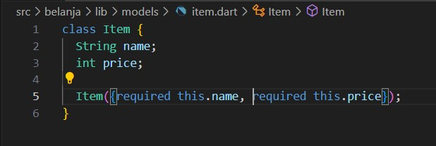

**Langkah 5: Lengkapi kode di class HomePage**
Pada halaman HomePage terdapat ListView widget. Sumber data ListView diambil dari model List dari object Item.
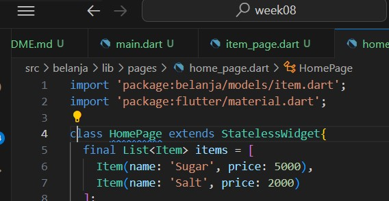

**Langkah 6: Membuat ListView dan itemBuilder**
ntuk menampilkan ListView pada praktikum ini digunakan itemBuilder. Data diambil dari definisi model yang telah dibuat sebelumnya. Untuk menunjukkan batas data satu dan berikutnya digunakan widget Card
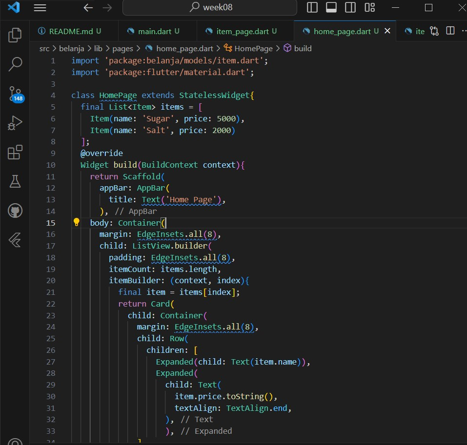
Jalankan aplikasi pada emulator atau pada device anda.
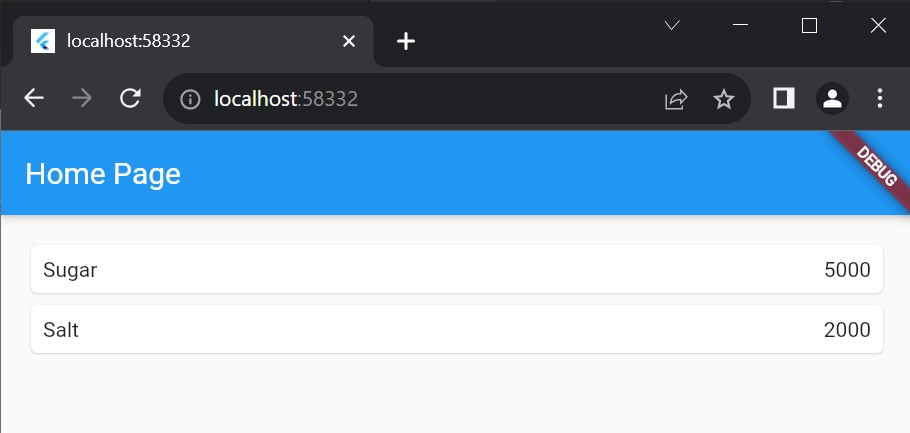

**Langkah 7: Menambahkan aksi pada ListView**
code
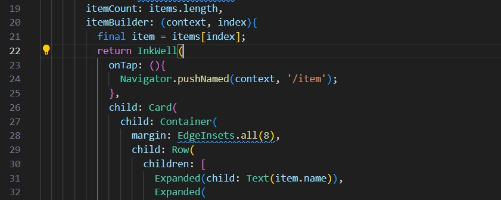
berhasil (hanya saja ini tampilan ss)
ketika di tap/ dipencet
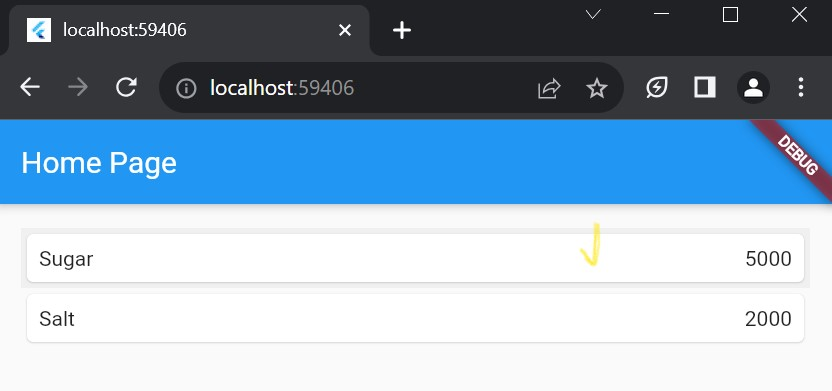
auto masuk ke route item/ page item
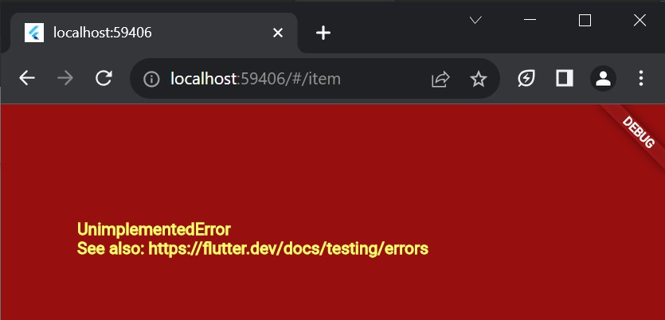

# Tugas Praktikum 2

**1. Perbarui kode pada bagian Navigator**
Untuk melakukan pengiriman data ke halaman berikutnya, cukup menambahkan informasi arguments pada penggunaan Navigator.
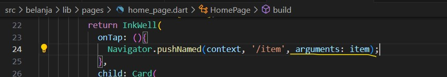

**2. Tambahkan kode berikut pada blok fungsi build dalam halaman ItemPage**
Pembacaan nilai yang dikirimkan pada halaman sebelumnya dapat dilakukan menggunakan ModalRoute. Tambahkan kode berikut pada blok fungsi build dalam halaman ItemPage

**Hasil AKhir**
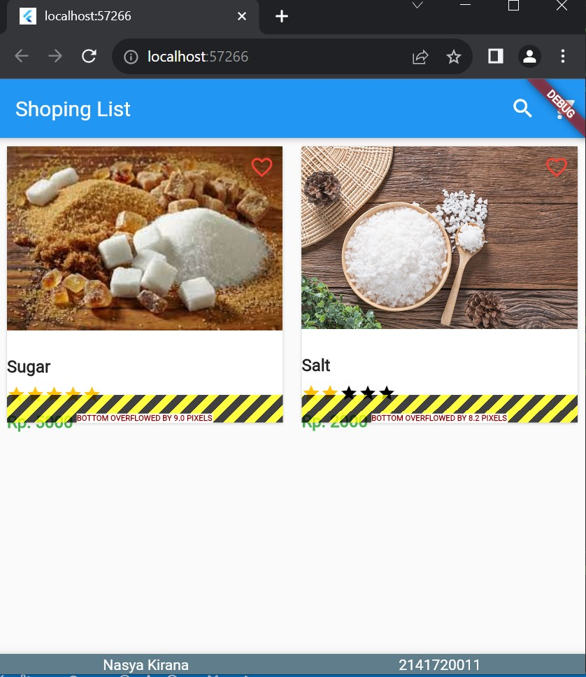
setelah di tap
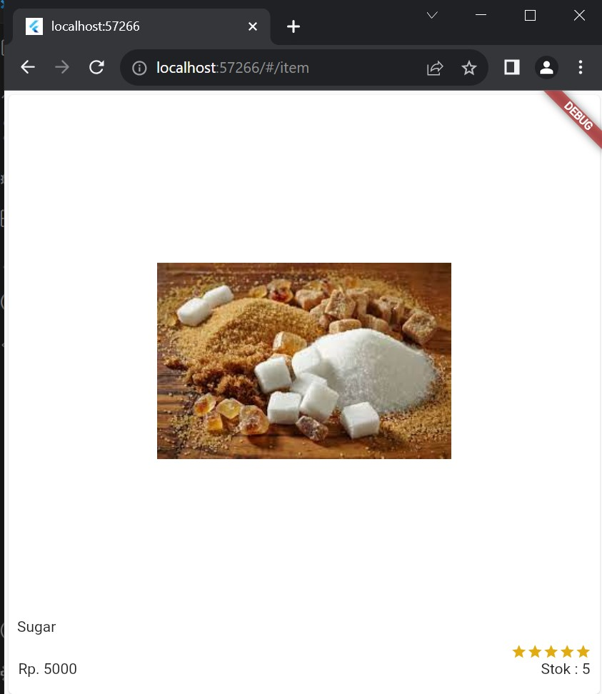
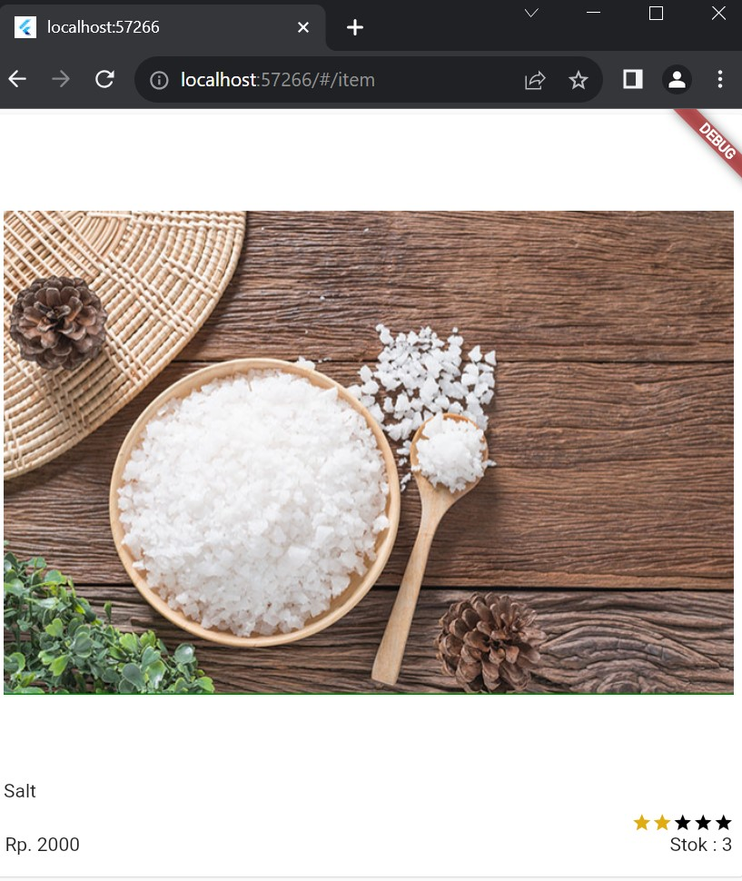