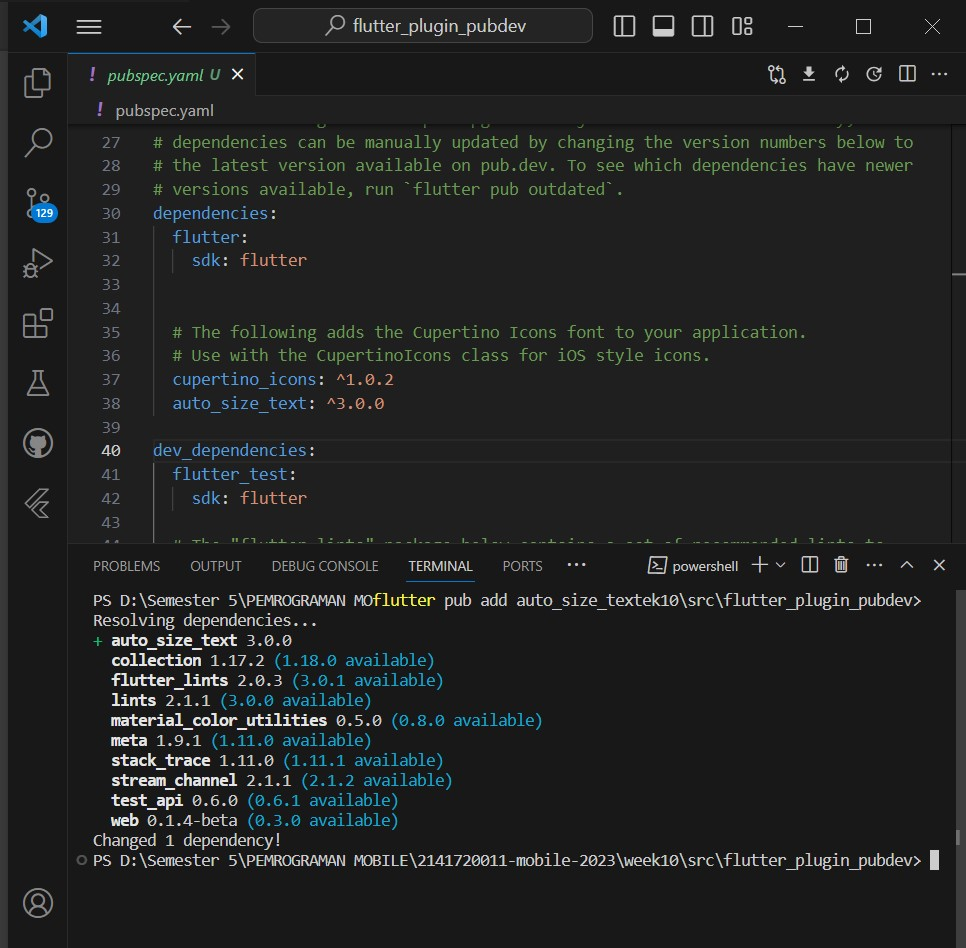

# 09 | Manajemen Plugin
**Nasyawa Ramadhia Kirana// 2141720011  //22**

## Praktikum : Menerapkan Plugin di project Flutter

**Langkah 1: Buat Project Baru**

**Langkah 2: Menambahkan Plugin**

**Langkah 3: Buat file red_text_widget**

**Langkah 4: Widget AutoSize Text**

 masalahnya adalah "Undefined name 'text'." Ini berarti bahwa ada penggunaan variabel atau identifier dengan nama 'text' yang tidak ditemukan atau belum didefinisikan 
 **Langkah 5: Buat Variabel text dan parameter di constructor**
 
**Langkah 6: Tambahkan widget di main.dart**
menamabahkan container di children class _MyHomePageState dan hasil output ketika di Run

### Tugas Praktikum
**1. Selesaikan**

**2. Jelaskan maksud dari langkah 2 pada praktikum tersebut!**

=> Di Langkah ini melakukan penambahan auto sized text
ini juga supaya teks nya bisa secara otomastis menyesuaikan ukuran dan terlihat bagus karena responsif di semua perangkat.

**3. Jelaskan maksud dari langkah 5 pada praktikum tersebut!**

=> Pada langkah 5 ini kita deklarasiin variabel text dan membuat parameter 'text' required / wajib diisi diberi nilai 

**4. Pada langkah 6 terdapat dua widget yang ditambahkan, jelaskan fungsi dan perbedaannya!**

=> Container awal yg kuning ini menampilkan text yg tidak terbaca semua namun gaya textnya bewarna merah
sedangkan yg container kedua dg latar hijau ini menampilkan text yg sama namun tampilannya lebih terlihat semua, 

**5. Jelaskan maksud dari tiap parameter yang ada di dalam plugin auto_size_text berdasarkan tautan pada dokumentasi ini !**

=> Parameter 
- 'text' , ini untuk menentukan teks yg ditampilkan dlam widget dan harus memberi nilai dlam bentuk string/ optional yg diinginkan
- 'style', ini untuk menentukan gaya teks yg ditampilin
- 'maxLines', ini untuk mengatur jumlah maksimum baris teks yg tampil dan ini memberikan nilainya di textoverflows.elipsisi jdi sesuai nilai itu barisnya tampil
- 'maxFontsize', mengatur ukuran font maksimum dan memastikan teks sesuai dalam widget
- 'minFontSize',mengatur ukuran font minimum yang akan digunakan
'textAlign', mengatur text di kiri, kanan,tengah, atau rata tengah

