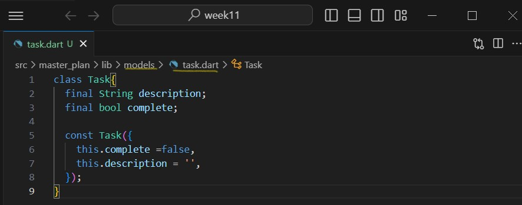

#  #11 | Dasar State Management
**Nasyawa Ramadhia Kirana// 2141720011  //22**

## Praktikum 1: Dasar State dengan Model-View

**Langkah 1: Buat Project Baru**

**Langkah 2: Membuat model task.dart**

terdapat Class Task yg punya atribut
- description, tipe data String
- complete, tipe boolean

Class ini akan menyimpan data tugas untuk apk kita

**Langkah 3: Buat file plan.dart**
- sebuah List untuk menyimpan daftar rencana dalam aplikasi to-do ini

**Langkah 4: Buat file data_layer.dart**

untuk meringkas proses impor, kita mengekspor kedua model tersebut dg membungkus beberapa data layer ke dalam sebuah file data_layer

 **Langkah 5: Pindah ke file main.dart**
 - disni masih ada merah, karena belum membuat file plan_screen 
 

**Langkah 6: buat plan_screen.dart**
- file plan_screen dg templat StatefulWidget
- masih ada error, karena belum dibuat methodnya

**Langkah 7: buat method _buildAddTaskButton()**
- menambahkan kode di bawah method build di dalam class planscreenstate
- masih terdapat error, karena ada widget yg belum terbuat

**Langkah 8: buat widget _buildList()**
- widget berupa List yang dapat dilakukan scroll, yaitu ListView.builder

**Langkah 9: buat widget _buildTaskTile**

**Langkah 10: Tambah Scroll Controller**
- supaya bisa di scroll

**Langkah 11: Tambah Scroll Listener**

**Langkah 12: Tambah controller dan keyboard behavior**

**Langkah 13: Terakhir, tambah method dispose()**

**Langkah 14: Hasil**

## **Tugas Praktikum 1: Dasar State dengan Model-View**
1. Selesaikan langkah-langkah praktikum tersebut, lalu dokumentasikan berupa GIF hasil akhir praktikum beserta penjelasannya di file README.md! Jika Anda menemukan ada yang error atau tidak berjalan dengan baik, silakan diperbaiki.
2. Jelaskan maksud dari langkah 4 pada praktikum tersebut! Mengapa dilakukan demikian?
=> Membuat file data_layer yang dalamnya membungkus plan dan task
supaya membantu menyerderhanakn dan mempermudah manejemen import dlm apk. Jadi jika kita butuh plan, kita tinggal import aja

3. Mengapa perlu variabel plan di langkah 6 pada praktikum tersebut?
=> untuk menyimpan/merepresentasikan objek 'plan'
 Mengapa dibuat konstanta ?
 => untuk menunjukan bahwa objek itu mrupakan objek yg tidak dapat diubah stelah pembuatannya.

4. Lakukan capture hasil dari Langkah 9 berupa GIF, kemudian jelaskan apa yang telah Anda buat!

=> Dilihat dari hasil diatas, Kita membuat aplikasi Master Plan
Dsini, ListView.builder menampilkan daftar tugas nantinya.
- user dapat menambahkan tugas dg menekan button tambah
- ada checkbox yang bisa ditekan ( bisa menandai) dan sebelahnya deskripsi 

5. Apa kegunaan method pada Langkah 11 dan 13 dalam lifecyle state ?

=> Langkah 11 (Menambahkan Scroll Listener), listernen ditambahkan agar ketika terjadi perubahan pd scroll, fungsi yg dipanggil(FocusScope) ini menghialnagkan fokus dri elemen yg difokuskan spert textfield.
bisa disingkat,pengguna dapat mengakses konten secara lebih leluasa tanpa terjebak pada elemen yang memerlukan input

=> Langkah 13 (Menambahkan dispose),berguna ketika widget sudah tidak digunakan lagi karena dispose() berguna untuk melakukan pembersihan atau pelepasan sumber daya yang digunakan oleh widget atau state 
dan di kode ini, dispose terhadap 'ScrollController

6. Kumpulkan laporan praktikum Anda berupa link commit atau repository GitHub ke spreadsheet yang telah disediakan!

## Praktikum 2: Mengelola Data Layer dengan InheritedWidget dan InheritedNotifier

InheritedWidget dapat digunakan sebagai pintu untuk komunikasi antara view dan data layers.

**Langkah 1: Buat file plan_provider.dart**

**Langkah 2: Edit main.dart**

**Langkah 3: Tambah method pada model plan.dart**

**Langkah 4: Pindah ke PlanScreen**
=> masuk ke Langkah 5

**Langkah 5: Edit method _buildAddTaskButton**

**Langkah 6: Edit method _buildTaskTile**

**Langkah 7: Edit _buildList**

**Langkah 8: Tetap di class PlanScreen**
membungkus (wrap) _buildList dengan widget Expanded dan memasukkan ke dalam widget Column pada Langkah 9

**Langkah 9: Tambah widget SafeArea**

## **Tugas Praktikum 2: InheritedWidget**

1. Selesaikan langkah-langkah praktikum tersebut, lalu dokumentasikan berupa GIF hasil akhir praktikum beserta penjelasannya di file README.md! Jika Anda menemukan ada yang error atau tidak berjalan dengan baik, silakan diperbaiki sesuai dengan tujuan aplikasi tersebut dibuat.

2. Jelaskan mana yang dimaksud InheritedWidget pada langkah 1 tersebut! Mengapa yang digunakan InheritedNotifier?

=> InheritedWidget, memungkinkan data dpt diwariskan ke bawah pohon widget jadi maksudnya ketika inheritedwidget diubah nilainya, smua widget yg bergantung pd widget tsbut dan menggunakan buildcontext yg sama akan diberitau perubh tsbut

=> InheritedNotifier, turunannya inheritedwidget yg menggunakan valuenotifier sbagai notif perubahan pdadata yg diwariskan.
Penggunan InheritedNotif ini memungkinkan membuat PlanProvider yg bertnggungjawab dalam menyediakan akses kke valuenotif ke widget tree, memungkin widget dlm aplikasi merespon perubaahan pd objek plan dg mudah

3. Jelaskan maksud dari method di langkah 3 pada praktikum tersebut! Mengapa dilakukan demikian?
=> method completedCount merupakan getter yang mengembalikan jumlah tugas (tasks) yang telah selesai dalam rencana (Plan).
=> method completenessMessage adalah getter yang mengembalikan pesan yang menggambarkan tingkat kelengkapan/keberhasilan dari rencana berdasarkan jumlah tugas yang telah selesai.

Jadi keseluruhannya, penambahan cimpleteCount dan Complemessage membantu mnegelola menyediakan informasi kemajuan dari suatu plan

4. Lakukan capture hasil dari Langkah 9 berupa GIF, kemudian jelaskan apa yang telah Anda buat!

=> Hasil Terbaru, ada tambahan informasi progress nya, notif di bawah halaman 
'.. out of .. task' yaitu dari method langkah 3

namun jika di hp saat di run code saya saya kurang sempurna hasilnya saat meinputkan di baris bawah, keyboard muncul tidak muncul
Namun saat dijalankan di browser/chrome bisa , ter run dg sempurna

5. Kumpulkan laporan praktikum Anda berupa link commit atau repository GitHub ke spreadsheet yang telah disediakan!

