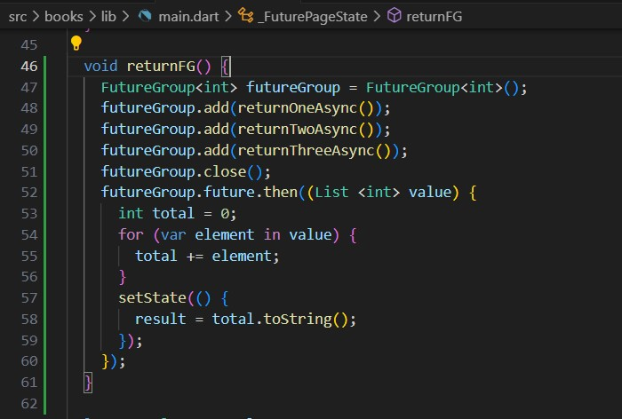

# **Pemrograman Mobile - 12 | Pemrograman Asynchronous**

**Nasyawa Ramadhia // 2141720011**

### Praktikum 1: Mengunduh Data dari Web Service (API)

**Langkah 1: Buat Project Baru**
 project flutter baru dengan nama books di folder src week-12

 
**Langkah 2: Cek file pubspec.yaml**
  berhasil install plugin, 

**Langkah 3: Buka file main.dart**
  **Soal 1**
    Tambahkan nama panggilan Anda pada title app sebagai identitas hasil pekerjaan Anda.

terdapat widget CircularProgressIndicator yang akan menampilkan animasi berputar secara terus-menerus, itu pertanda bagus bahwa aplikasi Anda responsif (tidak freeze/lag). Ketika animasi terlihat berhenti, itu berarti UI menunggu proses lain sampai selesai.

**Langkah 4: Tambah method getData()**
Tambahkan method ini ke dalam class _FuturePageState yang berguna untuk mengambil data dari API Google Books.

Carilah judul buku favorit Anda di Google Books, lalu ganti ID buku

**W12 : Soal 2**
menampilkan data JSON,

**Langkah 5: Tambah kode di ElevatedButton**

**W12 : Soal 3**
Jelaskan maksud kode langkah 5 tersebut terkait substring dan catchError!
- Substring, digunakan mengambil potongan string
substring(0, 450)=> substring untuk mengambil 450 karakter pertama dari hasilnya
- CatchError, dipakai di dlm kontruksi .then yg mana untuk menangkap dan menangani error yg munkin etrjadi

**Hasil Prak 1**

### Praktikum 2: Menggunakan await/async untuk menghindari callbacks

- async digunakan untuk menandai suatu method sebagai asynchronous dan itu harus ditambahkan di depan kode function.
- await digunakan untuk memerintahkan menunggu sampai eksekusi suatu function itu selesai dan mengembalikan sebuah value
- Untuk then bisa digunakan pada jenis method apapun, sedangkan await hanya bekerja di dalam method async.

**Langkah 1: Buka file main.dart**

**Langkah 2: Tambah method count()**

**Langkah 3: Panggil count()**

**Langkah 4: Run**

**Soal 4**
Jelaskan maksud kode langkah 1 dan 2 tersebut!

=> Langkah 1
- returnOneAsync , fungsi asychronus yg menunda pengembalian nilai 1 slama 3 detik
- returnTwoAsync , fungsi asychronus yg menunda pengembalian nilai 2 slama 3 detik
- returnThreeAsync , fungsi asychronus yg menunda pengembalian nilai 3 slama 3 detik

=> Langkah 2
- fungsi asynchronous count(), menjumlahkan nilai" yg dikembalikan oleh fungsi return One,two, three
- variabel total dg nilai awal 0, digunakan untuk menimpan hasil penjumlahan dari 3 fungsi tdi
- await, ditgunakan untuk menunggu nilai yg dikembalika oleh return, nanti niali tsbut ditambahkan ke var total
- setState() untuk memperbarui state pd widget, mengubah nial variabel result jdi nilai dari total

### Praktikum 3: Menggunakan Completer di Future

- Menggunakan Future dengan then, catchError, async, dan await
- Melakukan operasi async di Dart dan Flutter yaitu dengan class Completer.

**Langkah 1: Buka main.dart**

**Langkah 2: Tambahkan variabel dan method**

**Langkah 3: Ganti isi kode onPressed()**

**Langkah 4:**

**Soal 5**
Jelaskan maksud kode langkah 2 tersebut!
=>
- terdapat obejk 'Completer', untuk menangani nilai yg akan dikembalikan di masa depan
- metode calculate, fungsi yg bertugas untuk melakukan komputasi/proses tertentu yg menghasilkan nilai di masa depan
- await Future.delayed(const Duration(seconds: 5)) digunakan untuk menunda eksekusi selama 5 detik setelah itu, completer.complete(42) dipanggil untuk menandai bahwa perhitungan telah selesai dengan hasil nilai 42. 

**Langkah 5: Ganti method calculate()**

**Langkah 6: Pindah ke onPressed()**

**Soal 6**
Jelaskan maksud perbedaan kode langkah 2 dengan langkah 5-6 tersebut!
- Di langkah 2, calculate() untuk menginisiasi completer nilai 42 dan ada delay 5 detik dg future.delayed
- di langkah 5, penanganan error ditambahkan di dalam calculate
- di langkah 6, .catchError() ditambahkan sebagai penanganan kesalahan jika terjadi error saat menunggu hasil dari getNumber()

### Praktikum 4: Memanggil Future secara paralel

FutureGroup tersedia di package async, yang mana itu harus diimpor ke file dart Anda, seperti berikut.

FutureGroup adalah sekumpulan dari Future yang dapat run secara paralel. Ketika run secara paralel, maka konsumsi waktu menjadi lebih hemat (cepat) dibanding run method async secara single setelah itu method async lainnya.

**Langkah 1: Buka file main.dart**

**Langkah 2: Edit onPressed()**

**Langkah 3: Run  (W12:Soal7)** 

**Soal 8**
Jelaskan maksud perbedaan kode langkah 1 dan 4!
=> pada langkah 1, penggunaan 'futuregroup' untuk mengelola sekelompok future dan memungkinkan penambahan future ke dalam grup secara dinamis
padda langkah 4, Future.wait untuk menunggu beberapa future sekaligus yang diwakili oleh list dari future-future yang diberikan. 

jadi kedua kode ini memberikan Pilihan antara menggunakan Future.wait langsung atau dengan bantuan FutureGroup.
namun, Future.wait bisa menjadi pilihan yang lebih sederhana. 

### Praktikum 5: Menangani Respon Error pada Async Code

Ada beberapa teknik untuk melakukan handle error pada code async
yaitu then() callback dan pola async/await.

**Langkah 1: Buka file main.dart**

**Langkah 2: ElevatedButton**

**Langkah 3: Run  W12:Soal 9**

debug console akan melihat teks Complete

**Langkah 4: Tambah method handleError()**

**Soal 10**

Panggil method handleError() tersebut di ElevatedButton, lalu run. Apa hasilnya? 

Jelaskan perbedaan kode langkah 1 dan 4!
=> Perbedaan utama terletak pada penanganan dan reaksi terhadap kesalahan

- Langkah 1 bertanggung jawab untuk membuat sebuah Future yang akan menghasilkan sebuah Exception setelah penundaan.
- Langkah 4 berfokus pada penanganan error yang mungkin terjadi saat menunggu dan mengeksekusi returnError(), menggunakan blok try, catch, dan finally untuk mengelola dan menangani error yang terjadi.
