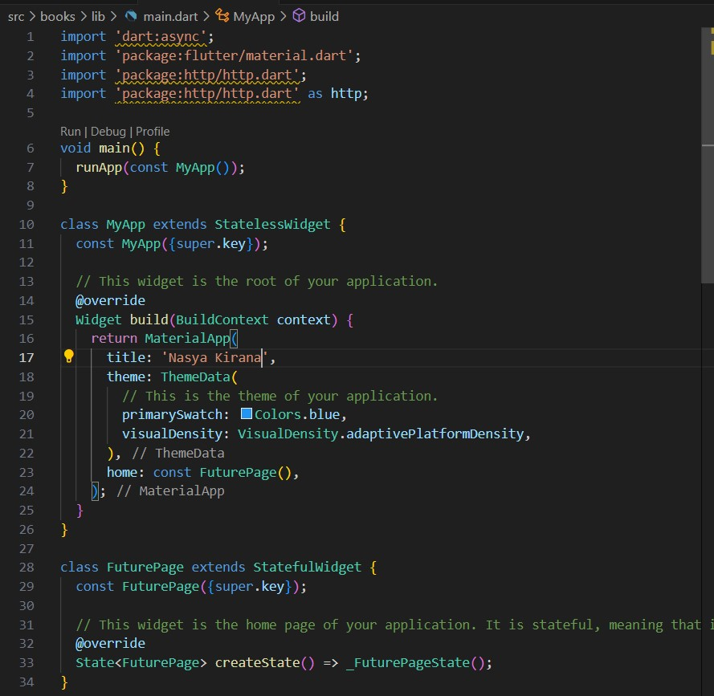

# **Pemrograman Mobile - 12 | Pemrograman Asynchronous**

**Nasyawa Ramadhia // 2141720011**

### Praktikum 1: Mengunduh Data dari Web Service (API)

**Langkah 1: Buat Project Baru**
 project flutter baru dengan nama books di folder src week-12

 
**Langkah 2: Cek file pubspec.yaml**
  berhasil install plugin, 

**Langkah 3: Buka file main.dart**
  **Soal 1**
    Tambahkan nama panggilan Anda pada title app sebagai identitas hasil pekerjaan Anda.

terdapat widget CircularProgressIndicator yang akan menampilkan animasi berputar secara terus-menerus, itu pertanda bagus bahwa aplikasi Anda responsif (tidak freeze/lag). Ketika animasi terlihat berhenti, itu berarti UI menunggu proses lain sampai selesai.

**Langkah 4: Tambah method getData()**
Tambahkan method ini ke dalam class _FuturePageState yang berguna untuk mengambil data dari API Google Books.

Carilah judul buku favorit Anda di Google Books, lalu ganti ID buku

**W12 : Soal 2**
menampilkan data JSON,

**Langkah 5: Tambah kode di ElevatedButton**

**W12 : Soal 3**
Jelaskan maksud kode langkah 5 tersebut terkait substring dan catchError!
- Substring, digunakan mengambil potongan string
substring(0, 450)=> substring untuk mengambil 450 karakter pertama dari hasilnya
- CatchError, dipakai di dlm kontruksi .then yg mana untuk menangkap dan menangani error yg munkin etrjadi

**Hasil Prak 1**

