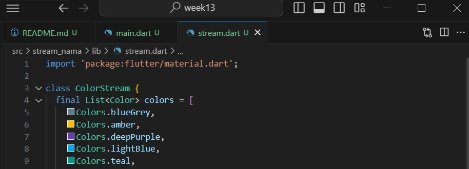

# **Pemrograman Mobile - 13 | Lanjutan State Management dengan Streams**

**Nasyawa Ramadhia // 2141720011**

### Praktikum 1: Dart Streams

**Langkah 1: Buat Project Baru**
 project flutter baru dengan nama books di folder src week-13

 
**Langkah 2: Buka file main.dart**
  berhasil install plugin, 

**Soal1**
- Tambahkan nama panggilan Anda pada title app sebagai identitas hasil pekerjaan Anda.
- Gantilah warna tema aplikasi sesuai kesukaan Anda.
- Lakukan commit hasil jawaban Soal 1 dengan pesan "W13: Jawaban Soal 1"

**Langkah 3: Buat file baru stream.dart**
Buat file baru di folder lib project

**Langkah 4: Tambah variabel colors**

**W13 : Soal 2**
menampilkan data JSON,

**Langkah 5: Tambah method getColors()**

**Langkah 6: Tambah perintah yield* .**

**W13 : Soal 3**
- Jelaskan fungsi keyword yield* pada kode tersebut!

=> Fungsi yield*, untuk meneruskan/melewatkan nilai dari generator stream lain ke dalam stream saat ini

- Apa maksud isi perintah kode tersebut?

=> Kode tersebut membuat sebuah Stream yang menghasilkan nilai dari sebuah list colors pada interval waktu satu detik.

-Stream.periodic adalah sebuah metode yang ada di Dart untuk membuat Stream yang menghasilkan nilai pada interval waktu tertentu.

-const Duration(seconds: 1) adalah interval waktu yang ditetapkan, 

**Langkah 7: Buka main.dart**
mengimpor stream

**Langkah 8: Tambah variabel**
menambahkan properti dalam class _StreamHomePageState

**Langkah 9: Tambah method changeColor()**

**Langkah 10: Lakukan override initState()**

**Langkah 11: Ubah isi Scaffold()**

**Langkah 12: Run** ("W13: Jawaban Soal 4")

**Soal 4**
Capture hasil praktikum Anda berupa GIF dan lampirkan di README.
Lakukan commit hasil jawaban Soal 4 dengan pesan "W13: Jawaban Soal 4"

**Langkah 13: Ganti isi method changeColor()**

**Hasil** (W13: Jawaban Soal 5)

**Soal 5**
Jelaskan perbedaan menggunakan listen dan await for (langkah 9) !
=> await for (langkah 9) maupun listen (langkah 11) adalah cara untuk mengakses nilai-nilai yang dihasilkan oleh sebuah Stream
namun,
- await for menunggu dan mengambil nilai-nilai dari Stream satu per satu secara berurutan secara sinkron 
- Metode .listen pada Stream memungkinkan kita untuk mendaftarkan callback yang akan dipanggil setiap kali ada nilai baru yang dihasilkan oleh Stream.

